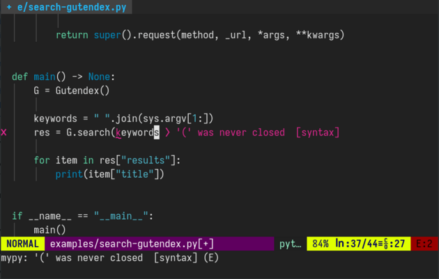
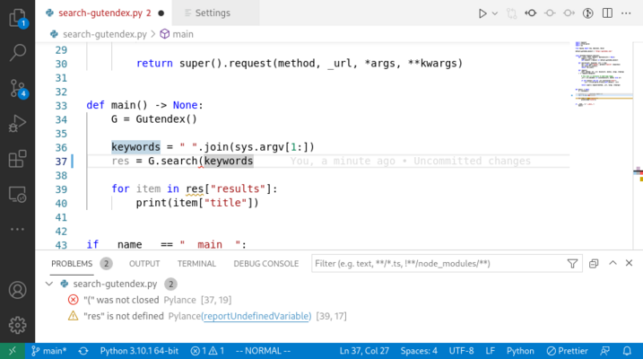
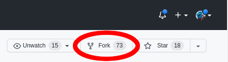
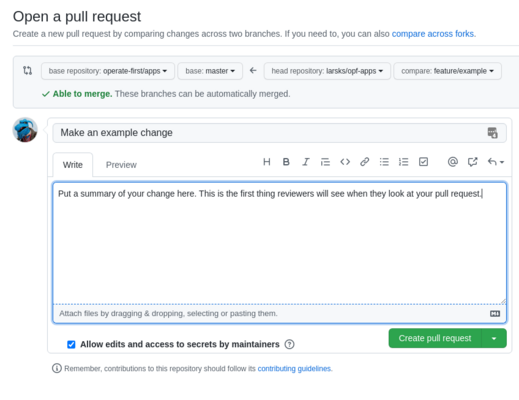

class: middle, center

# Code and Communication

Lars Kellogg-Stedman <lars@redhat.com>

.nodecoration[
- Slides: <http://oddbit.com/code-and-communication/>
- Source: <https://github.com/larsks/code-and-communication>
]

???

Three major topics to discuss:

- [You development environment](#section-devel)
- [Communication](#section-structure)
- [Pull request workflow](#section-git)


---

name: section-devel

class: middle, center

<a name="section-devel"></a>

# Your Development Environment

---

## Configure your editor

- Most editors can perform syntax highlighting, formatting, and
  syntax checking for you. Set this up and avoid trivial problems!

- Lots of good code editors

  - [Vim](https://www.vim.org) (or [Neovim](https://neovim.org))
  - [Visual Studio Code](https://code.visualstudio.com/)
  - [Atom](https://atom.io)
  - [Sublime Text](https://www.sublimetext.com/)
  - Etc etc etc
  - (...and also [Emacs](https://www.gnu.org/software/emacs/))

???

I'm not going to tell you which editor to use, but you should pick one that
can help you avoid trivial problems with your code.

Whatever editor you're using or language you're working with, we can
probably help you set things up.

---

## Configure your editor



Vim showing a syntax error.

---

## Configure your editor



VS Code showing a syntax error.

---

## Tell git which editor to use

Use the same editor for writing commit messages that you use for writing
code.

- Vim: `git config --global core.editor vim`
- VS Code: `git config --global core.editor "code -w"`
- Sublime: `git config --global core.editor "subl -w"`

???

Or configure using your `$VISUAL` environment variable, which will be used
by more than just `git` (e.g. see [this answer on
unix.stackexchange.com][env-var-conventions]).

> The order of preference is the `$GIT_EDITOR` environment variable, then
> `core.editor` configuration, then `$VISUAL`, then `$EDITOR`, and then the
> default chosen at compile time, which is usually vi. ([`git-var` man
> page][man-git-var])

[man-git-var]: https://man7.org/linux/man-pages/man1/git-var.1.html
[env-var-conventions]: https://unix.stackexchange.com/questions/213367/where-do-editor-pager-browser-environment-variables-come-from

---

## Configure automatic linting

> Lint, or a linter, is a static code analysis tool used to flag
> programming errors, bugs, stylistic errors and suspicious constructs.
> ([linting on wikipedia][linting])

- Many projects include scripts for performing basic checks on your code
- Set these up as Git `pre-commit` or `pre-push` [hooks][]
- Instructions are often included in project contribution documentation

[linting]: https://en.wikipedia.org/wiki/Lint_(software)
[hooks]: https://git-scm.com/book/en/v2/Customizing-Git-Git-Hooks

???

Linting checks may be similar to the checks your editor can perform, but
may also have project-specific checks that your editor doesn't know about.

Ensuring that your code is free of "linting" errors respects the time of
upstream reviewers (and ensures your changes get reviewed faster).

---

## Configure automatic linting

The operate-first [apps][] repository includes instructions for setting up
checks using the [pre-commit][] tool in [contributing.md][]:

First:

```sh
$ pip install pre-commit
```

Then:

```sh
$ cd apps
$ pre-commit install
```

[apps]: https://github.com/operate-first/apps
[contributing.md]: https://github.com/operate-first/apps/tree/master/contributing.md
[pre-commit]: https://pre-commit.com/

???

[pre-commit][] is a Python tool that can automatically install itself as a
Git `pre-commit` hook, and then read project-specific checks from a
`.pre-commit-config.yaml` file included in the project repository.

---

## Configure automatic linting

```sh
$ git add cluster-scope/overlays/prod/moc/smaug/kustomization.yaml
$ git ci -m 'Add a file containing invalid YAML'
Tabs remover............................................Passed
Trim Trailing Whitespace................................Passed
Check for merge conflicts...............................Passed
Fix End of Files........................................Passed
Check for added large files.............................Passed
Check for case conflicts................................Passed
Check JSON..........................(no files to check)Skipped
Check for broken symlinks...........(no files to check)Skipped
Detect Private Key......................................Passed
yamllint................................................Failed
- hook id: yamllint
- exit code: 1

cluster-scope/overlays/prod/moc/smaug/kustomization.yaml
  154:9     error    syntax error: mapping values are not allowed here
  (syntax)
```

---

name: section-structure

class: middle, center

<a name="section-structure"></a>

# Structuring your commits

---

## What is communication?

Of course:

- How we write

But also:

- How we organize our changes
- How we present our changes to others

???

The first thing I'd like to discuss is how we communicate our changes to other
developers. Here, "other developers" may mean:

- People reviewing a change you're proposing,
- Other people working on the same codebase to which you have
  previously contributed,
- Future You, returning to a project you haven't worked on in a while

"Communication" in this case covers both obvious things, like how we
express ourselves in written form, but it also covers things like how
we structure our changes and how we make other developers aware of our
work.

If we are able to clearly communicate the intent behind proposed code
changes, it makes it easier for reviewers to understand the purpose of
the changes, which in turn makes it easier for them to effectively
review it.

Properly structuring our changes can help people understand what's
going on ("Ah, I see first you added new function to this module, then
update the other module to take advantage of them").

---

## Make small changes

  <https://google.github.io/eng-practices/review/developer/small-cls.html>

> One difference between small focused commits and large unfocused commits
> is a difference of who is in control: you, or the code you’ve already
> written. ([codingitwrong][])

[codingitwrong]: https://codingitwrong.com/2021/09/08/small-commits-and-the-power-of-git-bisect.html

- Reviewed more quickly
- Reviewed more thoroughly
- Less likely to introduce bugs
- Less wasted work if they are rejected
- Easier to merge
- Easier to design well
- Less blocking on reviews
- Simpler to roll back

???

Smaller changes are easier for you to understand, and they're easier for a
reviewer to understand.

---

## Make atomic changes

  <https://www.aleksandrhovhannisyan.com/blog/atomic-git-commits/>

> [...] atomic commits [...] are responsible for documenting a single,
> complete unit of work. [This] means that you should be able to describe
> your changes with a single, meaningful message without trying to tack on
> additional information about some unrelated work that you did.
> ([Aleksandr Hovhannisyan][aleksandrhovhannisyan])

[aleksandrhovhannisyan]: https://www.aleksandrhovhannisyan.com/blog/atomic-git-commits/

- Easier to track down bugs
- Easier to revert/drop/amend
- More structured approach to larger tasks

???

If you've made a number of changes to a project, don't just `git
commit -a` and dump everything into a single commit. Consider a
situation where you:

- Fix some simple typos
- Modify the behavior of an existing function
- Introduce a new feature

If at some point in the future it turns out that your modifications to
the existing function were incorrect and these are all lumped together
in a single commit, it's not possible to simply `git revert` the
change: this results in more work for whoever is maintaining the code
(possibly you!).

Instead, group this into three separate commits.

---

## Structuring your commits

Be careful with the three Rs:

- Reformatting
- Refactoring
- Renaming


???

If you have to reformat large chunks of code (e.g., applying an automatic
formatter to a file, or refactoring parts of your code), make that a commit by
itself.

Reformatting a file may touch every single line in a file. This
makes it impossible to identify "real" changes (i.e., those that are
operationally significant) from changes that are simply due to the
reformatting.

It also has implications for the output of things like `git blame`,
because it will look like you are responsible for every line in the
file.

Renaming should be done in isolation to ensure that Git is able to recognize
the rename (rather than seeing you delete one file and create a new one).

---

## There's no such thing as too many commits

- Commit early, commit often

> Git only takes full responsibility for your data when you commit. If
> you fail to commit and then do something poorly thought out, you can
> run into trouble. Additionally, having periodic checkpoints means
> that you can understand how you broke something. ([sethrobertson][])

???

It is much easier to follow some of the principles we discussed earlier if you
commit your changes as you are working on them, rather than waiting until
everything is "finished".

This also makes it easier to share your code with others before it's
complete; for example, if you want to make sure you're heading down
the right path, you can make a draft pull request and ask someone to
take a look at it (or just point them at your branch). As you commit
and push changes to your repository, the pull request will update.

When you think things are ready, you can remove the draft indication.

There are other benefits to this methodology as well: having a
granular commit history makes it easier to recover from mistakes ("I
didn't meant to delete that file!" or "I have made a terrible,
terrible decision and need to revert back to something that works!").

---

name: section-messages

class: middle, center

<a name="section-messages"></a>

# Commit messages

---

## Writing good commit messages

> Our commit messages are our love letters to the future maintainers of our
> code. ([simplethread][])

???

> [...] computers don't care what a commit message looks like, but it
> affects the humans interacting with the codebase. Good programmers write
> commit messages that humans can understand.
> 
> [...] how we commit code can be as important as what code
> we commit. The code we write will be changed over time, but the commit
> message we write will live forever as a snapshot of our intent, what we
> thought the system should do and why.
> 
> Our commit messages are our love letters to the future maintainers of our
> code. ([simplethread][])

[simplethread]: https://www.simplethread.com/git-commit-message-101/

---

## Writing good commit messages: Conventions

Follow common conventions:

- Separate subject from body with a blank line
- Limit the subject line to 50 characters (-ish)
- Capitalize the subject line
- Do not end the subject line with a period
- Use the imperative mood in the subject line ("if applied, this commit
  will...")
- Wrap the body at 72 characters

???

There are no Commit Message Police that will come after you if you
don't follow these conventions, but adopting these guidelines helps
lead to uniform commit history that is easier for someone to follow
(and that will display well on a variety of platorms).

---

## Writing good commit messages: The Good

Be descriptive:

- The subject line should be meaningful.

- Explain why the changes were necessary and how you addressed the
  problem.

- Do not describe what files you changed (this is why we have
  `git log`).

- If you are responding to a particular issue/ticket/etc, mention that
  in the message (but don't substitute bug links for meaningful
  descriptions).

???

The first line of the commit message is displayed in commit lists on
GitHub (for example, in the [apps][] repository), or in the output of
`git log --oneline`:

```sh
$ git log --oneline -10
807883f6 Add scripts/fake-ksops.sh to ease testing w/o ksops
158964b4 increase smaug openshift-monitoring prom pvc size (#1550)
50ebaa1d Grant thoth-devops access to tekton-chains (#1548)
9d082291 Merge pull request #1523 from dystewart/add-annotations
c130d8d8 Changed default time range of `Cluster CPU Overview` dashboard. The previous time range did was contain any data (#1545)
1becde69 added to sre group (#1544)
8ad9b6ff Made requested changes to add_grafana_dashboard.md (#1542)
ff072fff fix: Remove null value from deployment of reloader (#1543)
2238c132 Add opf jh analysis notebook image yaml (#1541)
a9025240 Adding suppathak as sre group member (#1537)
```

If you can't come up with a succinct message to describe your commit,
it may be an indication that you need to split it into multiple
commits.

Don't be afraid to include links to external documentation in your
commits, for example:

```
commit 7e9784698d83b6f972b3ec785fccfaa996e1708a
Author: Lars Kellogg-Stedman <lars@redhat.com>
Date:   Fri Nov 5 12:36:14 2021 -0400

    Configure curator cluster to allow 4.8 -> 4.9 upgrade (#1292)

    This adds the necessary admin-ack for the 4.8 -> 4.9 upgrade
    described in KB 6329921 [1].

    [1]: https://access.redhat.com/articles/6329921
```

---

## Writing good commit messages: The Bad and the Ugly

Things never to put in a commit message:

- "Updated some files"
- "Responding to review requests"/"Made requested changes"
- "Fixed a typo" ([this][spelling] is how you do it)

[spelling]: https://github.com/acmesh-official/acme.sh/commit/9756adb9336daf7fdfd63ce83dde75aa269708d8

---

## Writing good commit messages: Examples

Some examples:

- https://github.com/containers/podman/commit/7e30531f20
- https://github.com/ansible/ansible/commit/9142be2f6c
- https://github.com/kubernetes/kubernetes/pull/107248/commits/a82c275df5

---

## You can organize after the fact

The commits you show to others don't need to match your local history.

>  If, after you are done, you want to pretend to the outside world that your
>  work sprung complete from your mind into the repository in utter perfection
>  with each concept fully thought out and divided into individual
>  concept-commits, well git supports that [...]. However, don't let tomorrow's
>  beauty stop you from performing continuous commits today. ([sethrobertson][])

[sethrobertson]: https://sethrobertson.github.io/GitBestPractices/

???

See e.g. <https://github.com/larsks/acct-manager/commits/master> vs
<https://github.com/larsks/acct-manager/commits/devel>

---

## Pull requests

- Should have a meaningful description

  Particularly when there are multiple commits, the pull request
  description should provide a broad summary of the changes.

---

## Pull requests

- Small is better than large

  Famously:

  > 10 lines of code = 10 issues.
  >
  > 500 lines of code = "looks fine."
  >
  > Code reviews.
  >
  > (twitter/[iamdeveloper][])

[iamdeveloper]: https://twitter.com/iamdevloper/status/397664295875805184

---

## Pull requests

- Passes test suite

  If there is a test suite, your pull request should pass it before you ask
  for code review.

---

name: section-git

class: middle, center

<a name="section-git"></a>

# Working with Pull Requests

---

## Preparing your GitHub account

- Configure ssh key authentication

  <https://docs.github.com/en/authentication/connecting-to-github-with-ssh>

???

While not absolutely necessary, especially since GitHub no longer permits
password authentication for cloning repositories, setting up ssh
authentication will lead to a smoother workflow and generally avoid many of
the security concerns associated with passwords.

---

## Preparing your local repository

Before you can submit a pull request:

- Fork upstream repository
- Clone the fork to your local system
- Add upstream repository as an additional remote

???

For simple changes, you can actually skip all of this and make the changes
directly through the GitHub web ui (which will automate the fork and pull
request process), but for anything other than trivial changes you probably
want to make use of your local development environment.

---

## Preparing your local repository

Fork upstream repository:

- Click "Fork" button in upstream repository on GitHub
- This creates a copy of the repository under your name in GitHub



---

## Preparing your local repository

Clone the fork to your local system:

```sh
$ git clone git@github.com:yourusername/reponame
```

This will create a directory `reponame` in your current directory.

---

## Preparing your local repository

Add upstream repository as an additional remote:

```sh
$ cd reponame
$ git remote add upstream git@github.com:upstream_org/reponame
$ git remote -v
origin  git@github.com:yourusername/reponame (fetch)
origin  git@github.com:yourusername/reponame (push)
upstream        git@github.com:upstream_org/reponame (fetch)
upstream        git@github.com:upstream_org/reponame (push)
```

???

We'll use the `upstream` remote to pull upstream changes into our
local development branch.

---

## Preparing your local repository

Alternate method, using the [GitHub CLI][].

```sh
$ gh repo fork --clone upstream_org/reponame
$ cd reponame
$ git remote -v
origin  git@github.com:myusername/reponame.git (fetch)
origin  git@github.com:myusername/reponame.git (push)
upstream        git@github.com:upstream_org/reponame.git (fetch)
upstream        git@github.com:upstream_org/reponame.git (push)
```

[github cli]: https://cli.github.com/

???

The GitHub CLI is a fantastic tool that gives you access to issues, pull
requests, repositories, gists, and many other GitHub features directly from
your command line.

E.g, viewing open pull requests:

```sh
$ gh pr list -L 10

Showing 10 of 23 open pull requests in operate-first/apps

#1552  adding resource bundling for acme and reloader    mubariskhan96:resourceBundling
#1546  Add osc-cl1 cluster to osc clusterset.            HumairAK:osc_cluster_set
#1536  connaisseur image signing                         cooktheryan:connaisseur
#1520  Argocd notifications slack integration            Gregory-Pereira:argocd-notifications-slack-in...
#1446  Add containerfile for gitops-books builder image  4n4nd:htg-build-ci
#1434  onboard a new project                             Leeron-Luzzatto:master
#1427  Add kyverno deployment to app root                screeley44:add-kyverno2
#1421  Configure opf-trino vpa to Auto update policy     apoorvam:vpa-trino-autoMode
#1407  Add role/rolebind for cluster-monitoring prom...  4n4nd:ocp-logging-role-fix
#1404  Adding namespace, configmaps and rbac for kyv...  screeley44:add-kyverno
```

---

## Start working on a new feature

- Make sure your repository is up-to-date:

  ```sh
  $ git remote update
  ```

- Create a new branch from the primary branch of the upstream repository:

  ```sh
  $ git checkout -b my-new-feature upstream/main
  ```

  (Upstream branch may be named `main` or `master` or possibly something
  else)

- Make awesome changes.

???

Always do your work on a branch. Keeping your local `main` branch
unmodified makes it easier to track upstream work.

---

## Push your changes

- Before you can create a pull request you need to push your changes to
  your fork on GitHub.

  For a new branch:

  ```sh
  $ git push -u origin HEAD
  ```

  For a branch that you've previously pushed:

  ```sh
  $ git push
  ```

???

In the above, `-u` is short for `--set-upstream-to`. It sets the default
destination for `git push` and `git pull` for this branch.

Using `HEAD` in `git push -u origin HEAD` pushes your local branch to a
branch of the same name in the remote. This saves you from having to type
in the branch name every time you need to run this command.

---

## Create a pull request

- Open your branch in GitHub. Find the "Compare & pull request" button...

  

- ...and click it.

---

## Create a pull request

- Fill in the pull request subject and description. If your PR has a single
  commit, the subject and description will be pre-filled from the commit
  message.

  

---

## Responding to review feedback

General guidelines:

- Respond in a timely fashion.
- Update existing commits to incorporate spelling fixes, correct typos,
  etc.
- Substantive changes and response to feedback should be new commits
- New commits should meet criteria we discussed earlier; "Responding to
  review comments" is not a useful commit message.

???

We create new commits for anything other than trivial changes so that
reviewers can see what changed.

In some cases, reviewers may ask you to squash your changes, which means
combining a number of existing commits into a single commit. We'll look at
how to do that shortly.

---

## Fixing the most recent commit

You need to fix a minor problem in your most recent commit:

- You've spotted a typo
- You forgot to include a file
- There is a syntax error

First:

- Edit your files

Then:

```sh
$ git add modifiled_file_name
$ git commit --amend
```

The `--amend` flag will update your commit with any changes you staged
using `git add` and will allow you to edit the commit message.

---

## Fixing the most recent commit

The `--amend` flag *replaces* your commit with a new one. Because you have
now *modified your commit history*, you can't simply `git push` your
changes:

```sh
$ git push
To github.com:larsks/opf-apps.git
 ! [rejected]          feature/example -> feature/example (non-fast-forward)
error: failed to push some refs to 'github.com:larsks/opf-apps.git'
hint: Updates were rejected because the tip of your current branch is behind
hint: its remote counterpart. Integrate the remote changes (e.g.
hint: 'git pull ...') before pushing again.
hint: See the 'Note about fast-forwards' in 'git push --help' for details.
```

---

## Fixing the most recent commit

You will need `git push --force` (or `-f`):

```
$ git push -f
[...]
To github.com:larsks/opf-apps.git
 + c97b3d14...39a5bc10 feature/example -> feature/example (forced update)
```

Safer:

```sh
$ git push --force-with-lease
```

This is where [git aliases][] are handy, but we'll cover that some other time.

[git aliases]: https://git-scm.com/book/en/v2/Git-Basics-Git-Aliases

---

## Git Rebase

From this point on we'll mostly be talking about the `git rebase` command.

The good:

- It's a flexible tool that gives you a variety of options for rewriting
  the history of your repository.

The bad:

- It's a flexible tool that gives you a variety of options for rewriting
  the history of your repository.

---

## Safety first!

- It's very hard to actually lose information with Git.
- If you're unsure about what you're doing, create a new branch and work on
  that.
- If you're *really* nervous, just make a copy of your working directory
  and use that instead.

---

## Squashing commits

"Squashing" means combining multiple commits into a single commit.

- Your team may prefer that 1 pull request == 1 commit
- You may want to incorporate minor fixes with a more substantial commit

```sh
$ git log --oneline upstream/master..
5f7f1f15 Fix line wrapping from previous commits
6a21de72 Add links to more information about OpenShift and Kubernetes
eb0be469 Replace K8s with Kubernetes
4f40fdb1 Replace OCP with OpenShift
$ git rebase -i upstream/master
```

???

We pretend that `commit1..commit2` means "commits between `commit1` and
`commit2`, but it really means:

> The .. (two-dot) Range Notation
>
>    The `^r1 r2` set operation appears so often that there is a shorthand
>    for it. When you have two commits `r1` and `r2`..you can ask for
>    commits that are reachable from `r2` excluding those that are
>    reachable from `r1` by `^r1 r2` and it can be written as `r1..r2`.

---

## Squashing commits

This brings up an editor with the following pick list:

```
pick db232024 Simplify sentence structure where we introduce Kustomize
pick 4885fdd7 Replace OCP with OpenShift
pick 24be0d9c Replace K8s with Kubernetes
pick 8e15b824 Add links to more information about OpenShift and Kubernetes
pick 95631154 Fix line wrapping from previous commits
```

We replace `pick` with `squash` (or `s`) to squash a commit with the one
preceding it:

```
pick db232024 Simplify sentence structure where we introduce Kustomize
squash 4885fdd7 Replace OCP with OpenShift
squash 24be0d9c Replace K8s with Kubernetes
squash 8e15b824 Add links to more information about OpenShift and Kubernetes
squash 95631154 Fix line wrapping from previous commits
```

---

## Squashing commits

- This will bring up an editor containing the merged commit messages from
  all the commits we're squashing. Massage the message until you're happy.

- Use `fixup` instead of `squash` if you just want to use the first commit
  message verbatim and discard the others.

---

## Updating the commit message in an older commit

You would like to rewrite the commit message in a commit that is not your
most recent commit.

First:

```sh
$ git rebase -i upstream/master
```

Then:

```
reword db232024 Simplify sentence structure where we introduce Kustomize
pick 4885fdd7 Replace OCP with OpenShift
pick 24be0d9c Replace K8s with Kubernetes
pick 8e15b824 Add links to more information about OpenShift and Kubernetes
pick 95631154 Fix line wrapping from previous commits
```

---

## Updating the commit message in an older commit

- For each commit you've marked `reword`, Git will open your editor with
  the commit message so that you can edit it.

- Save and exit your editor to continue.

---

## Updating files in an older commit

You want to make a correction to a commit that is not your most recent
commit:

First:

```
$ git rebase -i upstream/master
```

Then:

```
edit db232024 Simplify sentence structure where we introduce Kustomize
pick 4885fdd7 Replace OCP with OpenShift
pick 24be0d9c Replace K8s with Kubernetes
pick 8e15b824 Add links to more information about OpenShift and Kubernetes
pick 95631154 Fix line wrapping from previous commits
```

---

## Updating files in an older commit

- This will rewind your repository to the selected commit and drop you to a
  shell prompt.

- Make any necessary changes.

- `git rebase --continue`

- Edit commit message if necessary, then save and exit.

May lead to .red[[MERGE CONFLICTS][]].

[merge conflicts]: #mergeconflicts

---

name: mergeconflicts

## Merge Conflicts

> Merge conflicts occur when competing changes are made to the same line of
> a file ([GitHub][gh-merge-conflicts])

Let's say you have a file that contains:

```
This is a test.
```

And you modify it to read:

```
This was a test.
```

And someone else modifies it to read:

```
This is a file.
```

[gh-merge-conflicts]: https://docs.github.com/en/pull-requests/collaborating-with-pull-requests/addressing-merge-conflicts/resolving-a-merge-conflict-using-the-command-line

---

## Merge conflicts

When you try to incorporate those changes into your branch, you get:

```
$ git merge the-other-branch
Auto-merging README.md
CONFLICT (content): Merge conflict in README.md
Automatic merge failed; fix conflicts and then commit the result.
```

Or:

```
$ git rebase the-other-branch
Auto-merging README.md
CONFLICT (content): Merge conflict in README.md
error: could not apply 2339a0a... It was a test yesterday
hint: Resolve all conflicts manually, mark them as resolved with
hint: "git add/rm <conflicted_files>", then run "git rebase --continue".
hint: You can instead skip this commit: run "git rebase --skip".
hint: To abort and get back to the state before "git rebase", run "git rebase --abort".
Could not apply 2339a0a... It was a test yesterday
```

---

## Merge conflicts

When you open the conflicting file, you will see something like:

```
<<<<<<< HEAD
This is a file.
=======
This was a test.
>>>>>>> 2339a0a (It was a test yesterday)
```

For a merge:

- The first section represents your local version
- The second section represents the "other" version

For a rebase:

- The first section represents the "other" version
- The second section represents your local version

---

## Merge conflicts

Make the file look the way you want:

```
This was a file.
```

Stage your changes:

```
$ git add README.md
```

For a merge:

- Run `git commit`

For a rebase:

- Run `git rebase --continue`

---

## Updating your local branch with upstream changes

- First, make sure your local repository is current:

  ```sh
  $ git remote update
  ```

---

## Updating your local branch with upstream changes: Merging

- Merge the upstream changes into your local branch:

  ```sh
  $ git merge upstream/master
  ```

Pros:

- Often simpler

Cons:

- Leaves a trail of merge commits in your history

---

## Updating your local branch with upstream changes: Rebasing

- Merge the upstream changes into your local branch:

  ```sh
  $ git rebase upstream/master
  ```

Pros:

- Results in a clean, linear history

Cons:

- You will probably spend more time fixing merge conflicts.
